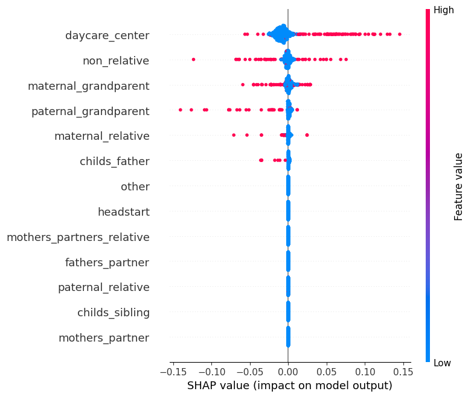

# Fragile Families Challenge and Childcare Impact

This project creates models to predict the six outcomes of the fragile families challenge using the associated dataset. Once these models were built, feature importance methods (XGBoost, SHAP values, and LIME) were used to understand the importance of day care centers vs. family care in the prediction of GPA and grit.

## Data
The data is not publicly available. To access the data, go to https://oprdata.princeton.edu/Archive/FF/ and follow the instruction listed

## Findings
Day care centers are most predictive of GPA when income is and isn't taken into account. When income is taken into account, a child enrolled in a day care center is generally more important to the model when the income ratio of the family increases. Day care centers are less predictive of grit, but when income is taken into account, it becomes more predictive. 

