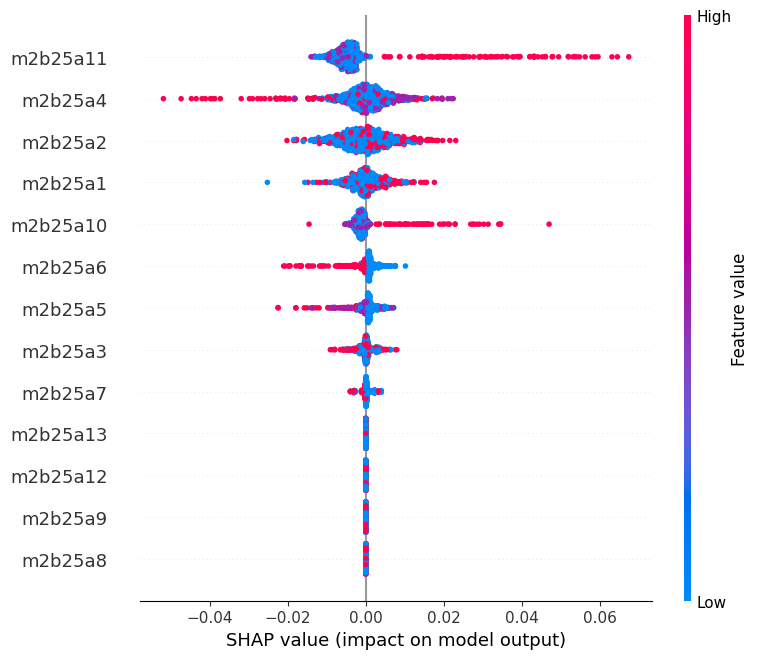

# Fragile Families Challenge and Childcare Impact

This project creates models to predict the six outcomes of the fragile families challenge using the associated dataset. Once these models were built, feature importance methods (XGBoost, SHAP values, and LIME) were used to understand the importance of different childcare options in the prediction of GPA and grit.

## Data
The data is not publicly available. To access the data, go to https://oprdata.princeton.edu/Archive/FF/ and follow the instruction listed

